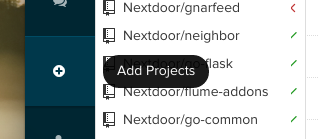
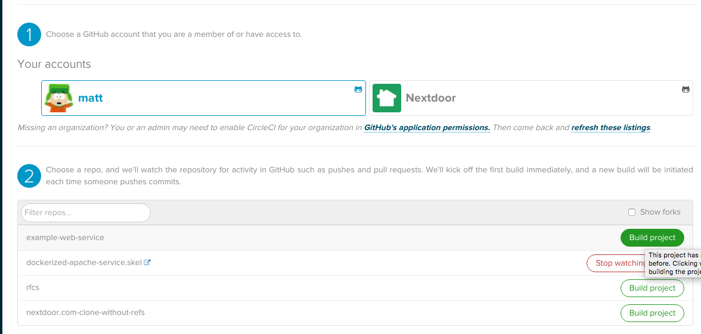
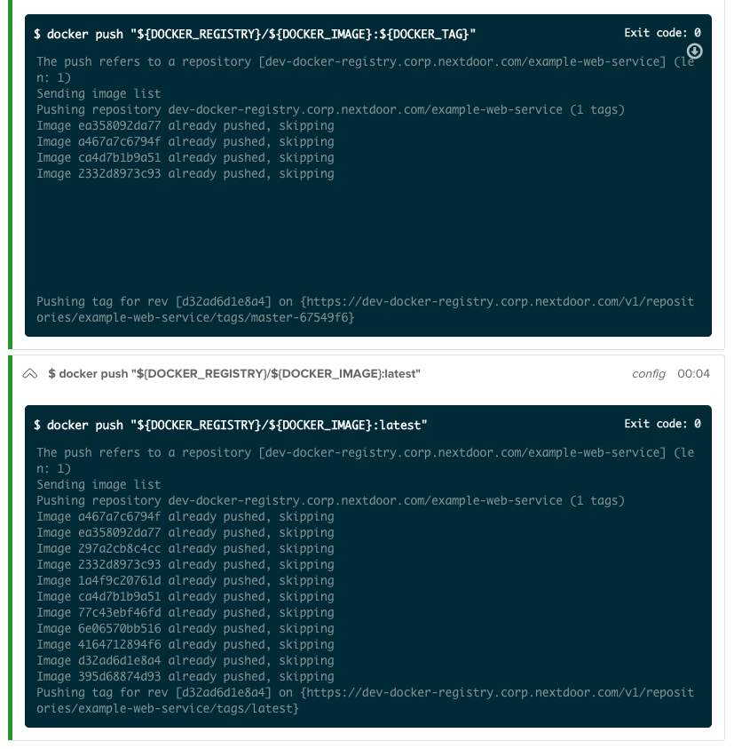

# Skeleton - Apache "Hello World"

- [About](#about)
- [Quick Start](#quick-start)
  - [Create your new project](#create-your-new-project)
  - [Prepare your project base](#prepare-your-project-base)
  - [Purge the Git History](#purge-the-git-history-and-create-a-fresh-one)
  - [Set up CircleCI Builds](#set-up-circleci-builds)
- [Developer Usage](#developer-usage)
  - [Setting up your Development Environment](#setting-up-your-development-environment)
  - [Setting up your Runtime Environment](#setting-up-your-runtime-environment)
  - [Logging into the Docker Registry](#logging-into-the-docker-registry)
  - [Pulling down the `latest` image](#pulling-down-the-latest-image)
  - [Building your local image](#building-your-local-image)
  - [Run your image and test it!](#run-your-image-and-test-it)

## About
Skeleton repository that provides a simple dockerized Apache service that
serves up a "Hello World" static page. This is the simplest possible example we
can provide of how to build a docker container in our environment using
[CircleCI](https://circleci.corp.nextdoor.com) as your build and release
tool.

## Quick Start

### Create your new project

Create a new repository in [GHE](https://git.corp.nextdoor.com) by clicking
[Use this template](https://git.corp.nextdoor.com/Nextdoor/hello-world-apache.template/generate).
**Make sure to do this under the right Organization**.

### Create your Boneman resources
[project]: https://git.corp.nextdoor.com/Nextdoor/boneman.git/blob/main/projects/hello-world-apache.template.yaml
[boneman]: https://git.corp.nextdoor.com/Nextdoor/boneman.git

If you're going to be launching your project as a service, you need to head
over to the [boneman.git][boneman] repository and request some resources. Check
out the [projects/hello-world-apache.template.yaml][project] file for an that
launches the stack for this repo.

### Create the target ECR Repository

To publish your ECR images, you will need to create your target
[ECR](https://go.corp.nextdoor.com/ecr) repository. Follow the instructions
over there for creating your repo. It should look something like this (where
`new-service` is the name of your Git repository):

    $ aws --region us-west-2 ecr create-repository --repository-name ndev/new-service

### Prepare your project base

Next, pull down this skeleton repository into your new repo project path.

### Set up CircleCI Builds

Lastly, set up CircleCI automated builds of your project! Log into
[CircleCI](https://circleci.corp.nextdoor.com).

* Click on the
  [New Projects](https://circleci.corp.nextdoor.com/add-projects) link on the
  left side of the page:
  

* Select your username from the Organization list, find your project, and click
  the "Build Project" button:
  

  
  

## Developer Usage
_This is sample documentation.. but it walks you through how a developer may
use this skeleton repo in their project._

### Setting up your Development Environment

There is nothing special to do here -- your development environment is your
laptop. Whatever tools, editors, etc that you enjoy using you should continue
to use. You can absolutely develop directly on your Mac laptop.

    $ git clone git@git.corp.nextdoor.com:Nextdoor/hello-world-apache.template.git
    Cloning into 'hello-world-apache.template'...
    Warning: Permanently added 'git.corp.nextdoor.com,52.24.62.83' (ECDSA) to the list of known hosts.
    remote: Counting objects: 33, done.
    remote: Compressing objects: 100% (23/23), done.
    remote: Total 33 (delta 11), reused 25 (delta 4), pack-reused 0
    Receiving objects: 100% (33/33), 66.29 KiB | 0 bytes/s, done.
    Resolving deltas: 100% (11/11), done.
    Checking connectivity... done.

### Pulling down the `latest` image

In order to properly prepare your environment, you should pull down the
`:latest` image that has been built. This will allow your local `docker build
...`s to take advantage of any pre-built and cached layers that exist in the
registry already.

    $ DOCKER_TAG=latest make docker_pull
    /usr/local/bin/docker pull 364942603424.dkr.ecr.us-west-2.amazonaws.com/dev/hello-world-apache.template:latest
    latest: Pulling from dev/hello-world-apache.template
    Digest: sha256:6a5bf848a4747483c741971659701d12028ccb738bf1e15089cb2a62443ddf86
    Status: Image is up to date for 364942603424.dkr.ecr.us-west-2.amazonaws.com/dev/hello-world-apache.template:latest
    364942603424.dkr.ecr.us-west-2.amazonaws.com/dev/hello-world-apache.template:latest
    /usr/local/bin/docker tag 364942603424.dkr.ecr.us-west-2.amazonaws.com/dev/hello-world-apache.template:latest hello-world-apache.template

### Building your local image

Finally, building your image to test it is super easy!

    MacBook-Pro:hello-world-apache.template diranged$ make docker_build
    /usr/local/bin/docker build . \
    		-t hello-world-apache.template \
    		-t hello-world-apache.template:988e0cdee6fb2ad897ceac865094844dc065f740 \
    		-t dev/hello-world-apache.template:988e0cdee6fb2ad897ceac865094844dc065f740 \
    		-t 364942603424.dkr.ecr.us-west-2.amazonaws.com/dev/hello-world-apache.template:988e0cdee6fb2ad897ceac865094844dc065f740
    Sending build context to Docker daemon  494.1kB
    Step 1/9 : FROM ubuntu@sha256:017eef0b616011647b269b5c65826e2e2ebddbe5d1f8c1e56b3599fb14fabec8
     ---> 94e814e2efa8
    Step 2/9 : MAINTAINER Systems Infrastructure <systems-team@nextdoor.com>
     ---> Using cache
     ---> d9f2b6efd508
    Step 3/9 : RUN DEBIAN_FRONTEND=noninteractive apt-get update;     DEBIAN_FRONTEND=noninteractive apt-get install -y apache2 curl
    ...
     ---> Using cache
     ---> 9f02d5c3e432
    Successfully built 9f02d5c3e432
    Successfully tagged hello-world-apache.template:latest
    Successfully tagged hello-world-apache.template:988e0cdee6fb2ad897ceac865094844dc065f740
    Successfully tagged dev/hello-world-apache.template:988e0cdee6fb2ad897ceac865094844dc065f740
    Successfully tagged 364942603424.dkr.ecr.us-west-2.amazonaws.com/dev/hello-world-apache.template:988e0cdee6fb2ad897ceac865094844dc065f740

### Run your image and test it!

Now you can quickly and easily run your image with `make docker_run` -- and
subsequent executions of that command will automatically terminate the old
container and launch new ones.

    MacBook-Pro:hello-world-apache.template diranged$ make docker_run
    Stopping hello-world-apache.template
    Error response from daemon: No such container: hello-world-apache.template
    No existing container running.
    Running hello-world-apache.template
    7f758fc343b917b25b2ba97d28c02b31a30e5df82c21f4bcd237f5c8549b5dd6
    $ docker ps
    CONTAINER ID        IMAGE                         COMMAND                CREATED             STATUS              PORTS                   NAMES
    7f758fc343b9        hello-world-apache.template   "/app/entrypoint.sh"   25 seconds ago      Up 24 seconds       0.0.0.0:8443->443/tcp   hello-world-apache.template
    $ curl -k https://localhost:8443/
    Hello World! v0.01
